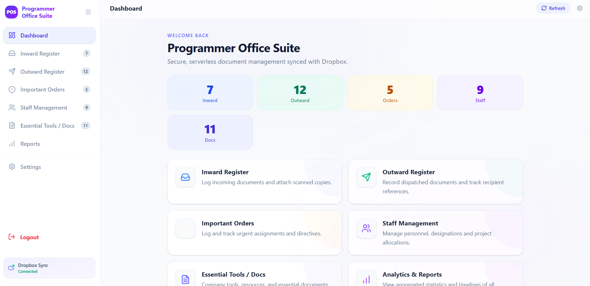
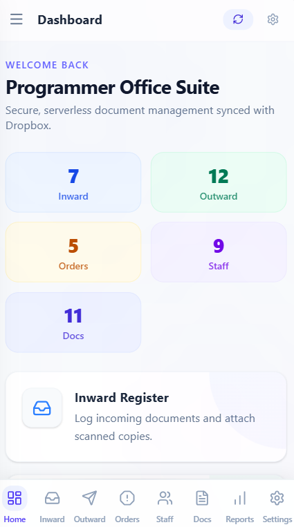

# 🏢 ProOffice: Professional Management Suite

[](https://reactjs.org/)
[](https://www.dropbox.com/)
[](https://tailwindcss.com/)
[](https://vercel.com/)

**ProOffice** is a high-performance, secure, and aesthetically pleasing office management application. Designed for speed and reliability, it centralizes document tracking, official orders, and staff management into a single, cohesive dashboard with seamless cloud synchronization.

---

## ✨ Key Features

### 📂 Document & Order Management
- **Inward/Outward Registers**: Track all official correspondence with ease.
- **Important Orders**: A dedicated module for mission-critical directives.
- **Advanced Searching**: Instant search across subjects, dates, and projects.
- **Smart Sorting**: Default sorting by Dispatch Number for Outward records to ensure high-priority visibility.

### 👥 Staff Directory
- **Personnel Management**: Maintain detailed records including IDs, posts, and contact details.
- **Interactive UX**: Drag-and-drop reordering with persistent cloud-saving.
- **Quick Actions**: One-click phone dialing and project-based filtering.

### ☁️ Cloud & Persistence
- **Dropbox Backend**: All data and attachments are securely stored and synced via the Dropbox API.
- **Multi-File Support**: Upload and preview PDFs, images, and videos directly within the app.

### 🛡️ Security & Performance
- **Timed Sessions**: Automatic logout after 8 hours to ensure data privacy.
- **Instant Refresh**: Smooth fetching and updating mechanisms for real-time collaboration.
- **Vercel Optimized**: Built for global delivery with lightning-fast load times.

---

## 🛠️ Tech Stack

- **Frontend**: React 18, Vite, TypeSript
- **Architecture**: Functional Components, Custom Hooks
- **Styling**: Tailwind CSS (Glassmorphism & Modern UI)
- **Icons**: Lucide React
- **Integration**: Dropbox SDK (Persistent JSON storage & File Hosting)
- **Deployment**: Vercel

---

## 🚀 Getting Started

### 1. Prerequisites
- Node.js (v18+)
- A Dropbox App with `files.content.write` and `files.content.read` permissions.

### 2. Installation
```bash
git clone https://github.com/BhuvneshSain/prg-office.git
cd prg-office
npm install
```

### 3. Environment Configuration
Create a `.env` file in the root directory:
```env
VITE_DROPBOX_ACCESS_TOKEN=your_access_token_here
VITE_AUTH_USERNAME=admin
VITE_AUTH_PASSWORD=your_secure_password
VITE_SESSION_DURATION_HOURS=8
```

### 4. Run Locally
```bash
npm run dev
```

---

## 📸 Preview




---

## 📄 License
Distributed under the **MIT License**. See `LICENSE` for more information.

---

**Developed with ❤️ by [Bhuvnesh Sain](https://github.com/BhuvneshSain)**
